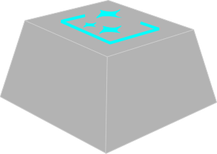

# Keycap Generator

  

  <strong>Browser-based 3D Keycap Generator</strong>

  
  
  

[日本語](#japanese) | [English](#english)

---

## 🇯🇵 日本語 (Japanese)

ブラウザ上で動作する、高機能な3Dキーキャップ・ジェネレーターです。主要なプロファイルに対応し、刻印からSTL/3MF書き出しまでシームレスに行えます。

### 🌐 関連リンク
- **[Keycap Generator Wiki](https://keycapgeneratorwiki.com/ja/home)**: 各種パラメータの詳細な解説、デザインのTips、トラブルシューティングを掲載しています。
- **[ツールページ](https://hololocheck.github.io/Keycap_Generator/)**: **インストール不要。** ブラウザから最新版を直接利用できます。

### 💡 インストール不要で即座に利用可能
このツールはクライアントサイドJavaScriptのみで構築されているため、ソフトウェアのダウンロードや複雑な環境構築は一切不要です。
- **Serverless**: 全ての演算（3D形状生成、CSG演算）がブラウザ上で完結します。
- **Cross-Platform**: Windows, Mac, Linuxなど、ブラウザがあれば即座に設計・エクスポートが可能です。

### ✨ 主な機能
- **多種多様なプロファイル**: Cherry, OEM, SA, XDA, DSAを搭載。
- **高度なテキスト編集**: 複数行印字、曲面への自動追従（Conform）、ダブルショット風書き出し。
- **SVGアイコン対応**: オリジナルロゴ（SVG形式）をキーキャップ表面に配置可能。
- **外部モデル合成 (Remix)**: 既存STLの結合（Union）や型抜き（Subtract）が可能。
- **3Dプリント最適化**: ステムのクリアランス調整、補強リブ、Lego Stud対応。
- **コスト・重量計算**: フィラメントに応じた概算重量とコストをリアルタイム算出。

### 📝 アップデート情報 (V68.0)
**"Typography & Workflow" Update**

キーキャップ上の「文字」を自由自在にデザインするための大型アップデートです。独自開発の3Dフォントエンジンにより、PCにある.ttf/.otfフォントをそのまま読み込めるようになりました。

- **3Dフォントエンジン**: 独自開発の **FontEngine3D** により、.ttf / .otf / .woff フォントをJSON変換なしに直接読み込み可能に。ハイブリッドレンダリング方式でカスタムフォントの曲線品質が大幅に改善されました。
- **ターゲット別フォント**: メイン文字・サブ文字・サイド印字にそれぞれ異なるフォントを設定可能に。
- **フォントマネージャー**: カスタムフォントの読み込み・管理・永続化（IndexedDB）を行う専用ダイアログを新設。3Dタイルプレビュー、検索、一括削除に対応。
- **SVGマネージャー**: カスタムSVGのインポート・永続化・ストックアイコンライブラリとの統合を行う管理ダイアログを新設。
- **文字設定パネル改修**: ターゲット切替プルダウンを導入。共有スライダー方式により、サブ文字・サイド印字の個別スライダーを廃止しUIを簡素化。
- **環境バックアップ**: Quick Save/Loadを廃止し、全パラメータ・ギャラリー・カスタムSVG・フォント・AMS設定を1ファイルで一括バックアップ・復元可能に。
- **HUD拡張**: 配置モード、生成モード、寸法線、FM/SM等のボタンを追加。アクティブ状態でシアンに変色するビジュアルフィードバックを実装。
- **エクスポート改善**: 全エクスポート処理を単一プログレスバー（%表示）に統一。
- **Keycap Slicer Bridge**: エクスポートダイアログから Bambu Studio / OrcaSlicer にモデルを直接転送可能に。ローカル常駐アプリ（Windows）がスライサーを自動検出し、ワンクリックで3Dモデルを送信。詳細は [Keycap Slicer Bridge](https://github.com/hololocheck/Keycap-Slicer-Bridge) を参照。
- **UIテーマ統一**: 全セクションをシアン (#00e5ff) テーマに完全統一。絵文字除去、トグルスイッチ統一。

> **V67.0 ("Visual Mastery & Manufacturing") のハイライト:**
> * **ビジュアル革命**: フローティングHUD、ガムボール操作、ギャラリー機能の実装。
> * **エンジニアリング (CSK)**: ランナー枠付きキット生成機能と、ダイスUIによる直感的な向き指定。
> * **AMS完全連携**: スライサー同期と画面キャプチャによる色設定取り込み。
> * **製造品質**: 非多様体エッジの自動修復機能 (MeshFixLib) と多様なステム生成。

---

## 🇺🇸 English

A high-performance 3D keycap generator that runs in your browser. Supports major profiles and provides seamless workflow from design to STL/3MF export.

### 🌐 Related Resources
- **[Keycap Generator Wiki](https://keycapgeneratorwiki.com/ja/home)**: Comprehensive guide for parameters, design tips, and troubleshooting.
- **[ToolPage](https://hololocheck.github.io/Keycap_Generator/)**: **No installation required.** Access the latest version directly in your browser.

### 💡 No Installation Required
Built entirely with client-side JavaScript, this tool requires no downloads or environment setup for both English and Japanese versions.
- **Serverless**: All 3D geometry generation and CSG operations are performed locally in your browser.
- **Cross-Platform**: Accessible from any PC (Windows, Mac, Linux) simply by visiting the link.

### ✨ Key Features
- **Various Profiles**: Pre-installed Cherry, OEM, SA, XDA, and DSA profiles.
- **Advanced Text Editing**: Multi-line legends, surface conforming, and double-shot style export.
- **SVG Icon Support**: Place your logos (SVG) directly on the keycap surface.
- **3D Model Remixing**: Import STL files for Union or Subtraction (Engraving) operations.
- **3D Print Optimization**: Stem clearance adjustment, reinforcement ribs, and Lego Stud support.

### 📝 Update Notes (V68.0)
**"Typography & Workflow" Update**

A major update for complete freedom over keycap typography. A newly developed 3D font engine lets you load .ttf/.otf fonts directly from your PC without any conversion.

- **3D Font Engine**: Custom-built **FontEngine3D** loads .ttf / .otf / .woff fonts directly — no JSON conversion. Hybrid rendering pipeline dramatically improves curve quality for custom fonts.
- **Per-Target Fonts**: Set a different font for each text target — Main Text, Sub Text, and Side Print.
- **Font Manager**: New dialog for importing, managing, and persisting custom fonts (IndexedDB). Features 3D tile preview, search, and bulk delete.
- **SVG Manager**: New dialog for importing, persisting, and integrating custom SVGs with the stock icon library.
- **Text Settings Redesign**: Target switching dropdown introduced. Shared slider system eliminates separate Sub Text / Side Print sliders for a cleaner UI.
- **Environment Backup**: Replaces Quick Save/Load. Back up and restore all parameters, gallery, custom SVGs, fonts, and AMS settings in a single file.
- **HUD Enhancements**: Added Placement mode, Generation mode, Dimension, FM/SM buttons. Active toggle buttons now turn cyan for visual feedback.
- **Export Improvements**: All export operations unified to a single progress bar with percentage display.
- **Keycap Slicer Bridge**: Send models directly to Bambu Studio / OrcaSlicer from the export dialog. A lightweight local app (Windows) auto-detects installed slicers and transfers 3D models in one click. See [Keycap Slicer Bridge](https://github.com/sireai/Keycap_Slicer_Bridge) for details.
- **UI Theme Unification**: Complete cyan (#00e5ff) theme across all sections. Emoji removed, toggle switches unified.

> **V67.0 ("Visual Mastery & Manufacturing") Highlights:**
> * **Visual Revolution**: Floating HUD, Gumball operation, and Gallery features.
> * **Engineering (CSK)**: Custom Sprue Kit generation with intuitive "Dice UI" for orientation.
> * **Full AMS Integration**: Slicer synchronization and color setting import via screen capture.
> * **Manufacturing Quality**: Automatic non-manifold edge repair (MeshFixLib) and diverse stem generation.

---

### 🛠 Technology Stack / 技術スタック
- **Engine**: [Three.js](https://threejs.org/)
- **Font Engine**: FontEngine3D (Custom) — TTF/OTF/CFF/CFF2/WOFF
- **Geometry Logic**: [three-bvh-csg](https://github.com/gkjohnson/three-bvh-csg), MeshFixLib (Custom)
- **Exporter**: STLExporter, OBJExporter, 3MFExporter (Original)
- **Slicer Bridge**: [Keycap Slicer Bridge](https://github.com/hololocheck/Keycap-Slicer-Bridge) — Bambu Studio / OrcaSlicer direct transfer

### 📄 License / ライセンス
MIT License.
